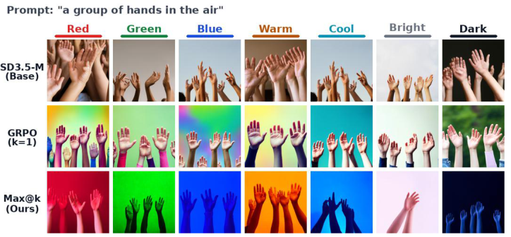
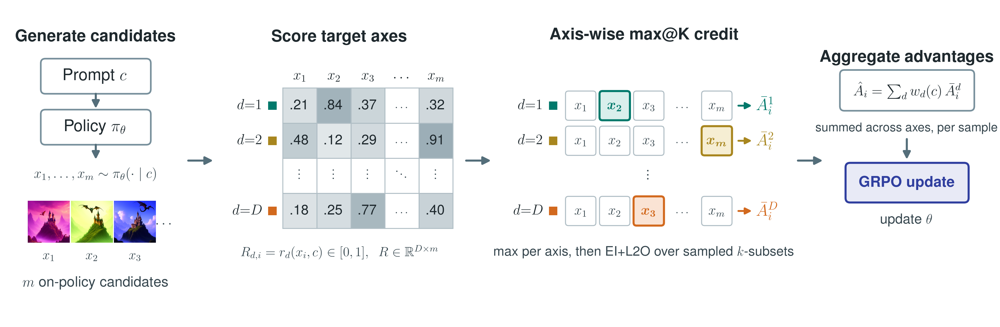

# Multi-Axis Max@K Reinforcement Learning for Representative Diversity in Text-to-Image Generation (WACV 2027)

**Ku Onoda, Paavo Parmas, Hiroki Furuta, Soichiro Nishimori, Yuta Oshima,
Shohei Taniguchi, and Yutaka Matsuo**

[](https://arxiv.org/abs/2607.14962)

Official PyTorch implementation of the WACV 2027 paper **Multi-Axis Max@K**. We train diffusion
models to cover multiple target modes across a set of images. Each mode selects
its strongest representative before rewards are aggregated, allowing different
images to receive credit for different modes.

<p align="center">
  
</p>
<p align="center"><i>
Seven pixel-based color rewards, one per column. After training, different
samples for the same prompt cover different modes.
</i></p>

<p align="center">
  
</p>
<p align="center"><i>
For each prompt, an m-image group is scored on D reward axes. Max@K credit is
computed independently per axis, normalized within the group, and then summed
into the policy advantage.
</i></p>

This repository includes the max@K estimator, a nine-mode synthetic demo, and
SD3.5-M training and evaluation for the perceived-appearance experiments
(CLIP rewards) and the controlled color experiment (rule-based pixel rewards).

## Installation

Use Linux and Python 3.10. Run commands from the repository root.

```bash
git clone https://github.com/KuOnoda/multi-axis-maxk.git
cd multi-axis-maxk

conda create -n multi-axis-maxk python=3.10 -y
conda activate multi-axis-maxk
python -m pip install --upgrade pip
python -m pip install torch==2.6.0 torchvision==0.21.0 \
  --index-url https://download.pytorch.org/whl/cu126
python -m pip install -e ".[train]"
```

Choose the corresponding official PyTorch wheel if your machine uses a different
CUDA version. Accept the access conditions for
[SD3.5 Medium](https://huggingface.co/stabilityai/stable-diffusion-3.5-medium)
and run `huggingface-cli login`. Model weights are downloaded through the
Hugging Face cache.

<details>
<summary>CPU demo and tests</summary>

In a Python 3.10 environment, use the CPU wheel and lightweight extras:

```bash
python -m pip install torch==2.6.0 --index-url https://download.pytorch.org/whl/cpu
python -m pip install -e ".[demo,test]"
python -m pytest
python examples/toy_distribution_transport.py
```

No model weights are needed. Figures and a JSON summary are written to
`examples/figures/`.

</details>

## Training

```bash
TRAIN_SEED=42 bash scripts/train_paper.sh race5 maxk
```

Choose an axis (`race5`, `gender2`, `race5_gender2`) and a method
(`maxk`, `max1`, `count`). Repeat with seeds 0, 1, and 42 for multi-run
evaluation. The launcher defaults to **32 GPU processes**, 16 candidates per
prompt, and 360 optimizer steps. W&B logging is offline by default.

See [configs/sd35_paper.py](configs/sd35_paper.py) for hyperparameters and
[scripts/train_paper.sh](scripts/train_paper.sh) for axis/window mappings and
launch options. The corresponding paper settings are in
[Appendix E, Table 2](https://arxiv.org/html/2607.14962v1#A5).

EMA LoRA checkpoints are saved at steps 120, 240, and 360 under
`logs/race5_maxk_seed42/checkpoints/checkpoint-<step>/lora/`.

The controlled color experiment (paper Sec. 5.2) runs on **one GPU** with
`m = k = 7`, each of the seven pixel axes multiplied by frozen PickScore, KL
weight 0, and the GenEval single-object prompts:

```bash
TRAIN_SEED=42 bash scripts/train_paper.sh color7 maxk     # ours, k=7
TRAIN_SEED=42 bash scripts/train_paper.sh color7 max1     # k=1 control
```

Checkpoints are saved every 120 steps up to step 960. Set
`REWARD_ANCHOR_KEY=none` for the rule-reward-only arm.

<details>
<summary>Multiple nodes and a smaller functional run</summary>

For four nodes with eight GPUs each, launch once on **each node**. Set
`MACHINE_RANK` to 0–3 and `MAIN_PROCESS_IP` to node 0's reachable address:

```bash
NUM_MACHINES=4 MACHINE_RANK=0 MAIN_PROCESS_IP=10.0.0.1 \
NUM_PROCESSES=32 TRAIN_SEED=42 \
bash scripts/train_paper.sh race5 maxk
```

`NUM_PROCESSES` is the total across nodes. Use your scheduler to allocate
resources; `MAIN_PROCESS_PORT` defaults to 29500. Set `DRY_RUN=1` to inspect
the command without starting training.

For a two-step functional check on a GPU with enough memory for the model,
reward scorer, and a 16-image rollout:

```bash
NUM_PROCESSES=1 SAMPLE_BATCH_SIZE=16 TRAIN_BATCH_SIZE=16 \
STOP_AT_GLOBAL_STEP=2 SAVE_EVERY_STEPS=1 FORCED_RUN_NAME=smoke_race5 \
bash scripts/train_paper.sh race5 maxk
```

The global rollout batch must be divisible by the group size (16, or 7 for
`color7`). The launcher requires equal sampling and training batch sizes. A
smaller run is not compute-matched to the paper. Set `FORCED_RUN_NAME` for a
separate run and `LOG_DIR` for another output directory. `LORA_PATH`
initializes from an adapter, without resuming optimizer or RNG state.

</details>

## Evaluation

Generate matched base/LoRA batches and score image quality:

```bash
bash scripts/download_aesthetic_head.sh

python evaluation/generate_and_score.py \
  --lora_path logs/race5_maxk_seed42/checkpoints/checkpoint-360/lora \
  --lora_name ours --save_images \
  --out_dir outputs/race5_maxk_seed42
```

Defaults match the paper's held-out generation settings: 200 occupation prompts,
16 images per prompt, 28 steps, CFG 4.5, and 512 × 512 resolution. Outputs include
saved images, `eval_results.json`, and `eval_per_image.csv`.

Audit the saved images with the CLIP prompt ensemble:

```bash
for model in base ours; do
  python evaluation/audit_clip.py \
    --image_dir "outputs/race5_maxk_seed42/images/${model}" \
    --axis race5 \
    --out "outputs/race5_maxk_seed42/clip_${model}_race5.json"
done
```

Use the corresponding axis for other experiments. The audit reports Fairness
Score and per-prompt mode coverage. Labels are automatic estimates of
**perceived attributes** of generated images, not self-identified demographics.

For the color experiment, `C_pix@12` is the mean over prompts and axes of the
best axis score among 12 images per prompt. The 50 Pick-a-Pic prompts are
fetched from upstream Flow-GRPO because the list contains explicit
user-written text:

```bash
bash scripts/fetch_pickapic_prompts.sh

python evaluation/generate_and_score.py \
  --lora_path logs/color7_maxk_seed42/checkpoints/checkpoint-960/lora \
  --lora_name ours --primary_reward_key pickscore \
  --prompts_path data/pickapic/test.txt --num_prompts 50 --prompt_seed 0 \
  --images_per_prompt 12 --num_inference_steps 40 --guidance_scale 4.5 \
  --seed 42 --save_images --skip_aesthetic \
  --out_dir outputs/color7_maxk_seed42

for model in base ours; do
  python evaluation/score_color_coverage.py \
    --image_dir "outputs/color7_maxk_seed42/images/${model}" \
    --m 12 --out "outputs/color7_maxk_seed42/c_pix_${model}.json"
done
```

<details>
<summary>Evaluation options and reproduction scope</summary>

- Add `--skip_pickscore --skip_aesthetic` for CLIP-T-only quality scoring.
  Use `--skip_base` when matching base samples already exist.
- Local weights: `MODEL_ID` for training, `--base_model` for generation, and
  `CLIP_MODEL_PATH`, `PICKSCORE_MODEL_PATH`, `PICKSCORE_PROCESSOR_PATH`, or
  `AESTHETIC_MODEL_PATH` for scorers. Scorer paths must exist locally.
- The released data contains 1,080 training prompts, 80 same-family test prompts,
  200 held-out occupation prompts, and the 80 GenEval single-object prompts used
  by the color experiment. Evaluation uses the occupation set or the fetched
  Pick-a-Pic prompts.
- Independent Qwen2.5-VL/FairFace audits, external baselines, and trained LoRA
  weights are not included.
- The synthetic demo illustrates the nine-mode experiment; it does not include
  the weighted-mode and mode-count sweeps in Appendix C.
- The count-control implementation excludes near-uniform score vectors from
  its counts. This extra guard is not specified in Appendix E's equations.

See each evaluation script's `--help` for further options.

</details>

## Acknowledgments

The diffusion training code is adapted from
[Flow-GRPO](https://github.com/yifan123/flow_grpo), with components originating
from [DDPO-PyTorch](https://github.com/kvablack/ddpo-pytorch) and
[Diffusers](https://github.com/huggingface/diffusers). The color-experiment
training prompts come from [GenEval](https://github.com/djghosh13/geneval).
We thank their authors for sharing their implementations.

Original code is MIT licensed. Third-party attribution and license copies are
preserved in [THIRD_PARTY_NOTICES.md](THIRD_PARTY_NOTICES.md) and `licenses/`.
Model weights have their own licenses.

## Citation

If you use this code in your research, please cite:

```bibtex
@inproceedings{onoda2027multiaxismaxk,
  title     = {Multi-Axis Max@K Reinforcement Learning for Representative Diversity in Text-to-Image Generation},
  author    = {Onoda, Ku and Parmas, Paavo and Furuta, Hiroki and Nishimori, Soichiro and Oshima, Yuta and Taniguchi, Shohei and Matsuo, Yutaka},
  booktitle = {Proceedings of the IEEE/CVF Winter Conference on Applications of Computer Vision (WACV)},
  year      = {2027},
  url       = {https://arxiv.org/abs/2607.14962}
}
```
